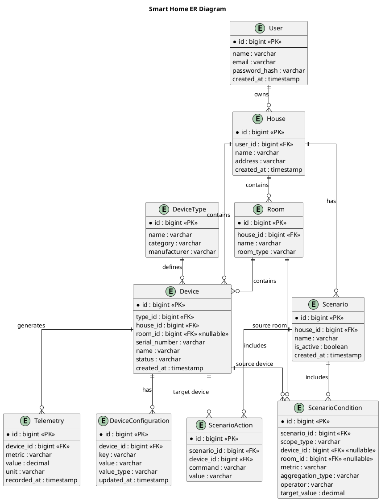

```puml
@startuml
title Smart Home ER Diagram

hide methods
hide stereotypes
skinparam linetype ortho

entity User {
  *id : bigint <<PK>>
  --
  name : varchar
  email : varchar
  password_hash : varchar
  created_at : timestamp
}

entity House {
  *id : bigint <<PK>>
  --
  user_id : bigint <<FK>>
  name : varchar
  address : varchar
  created_at : timestamp
}

entity Room {
  *id : bigint <<PK>>
  --
  house_id : bigint <<FK>>
  name : varchar
  room_type : varchar
}

entity DeviceType {
  *id : bigint <<PK>>
  --
  name : varchar
  category : varchar
  manufacturer : varchar
}

entity Device {
  *id : bigint <<PK>>
  --
  type_id : bigint <<FK>>
  house_id : bigint <<FK>>
  room_id : bigint <<FK>> <<nullable>>
  serial_number : varchar
  name : varchar
  status : varchar
  created_at : timestamp
}

entity DeviceConfiguration {
  *id : bigint <<PK>>
  --
  device_id : bigint <<FK>>
  key : varchar
  value : varchar
  value_type : varchar
  updated_at : timestamp
}

entity Telemetry {
  *id : bigint <<PK>>
  --
  device_id : bigint <<FK>>
  metric : varchar
  value : decimal
  unit : varchar
  recorded_at : timestamp
}

entity Scenario {
  *id : bigint <<PK>>
  --
  house_id : bigint <<FK>>
  name : varchar
  is_active : boolean
  created_at : timestamp
}

entity ScenarioCondition {
  *id : bigint <<PK>>
  --
  scenario_id : bigint <<FK>>
  scope_type : varchar
  device_id : bigint <<FK>> <<nullable>>
  room_id : bigint <<FK>> <<nullable>>
  metric : varchar
  aggregation_type : varchar
  operator : varchar
  target_value : decimal
}

entity ScenarioAction {
  *id : bigint <<PK>>
  --
  scenario_id : bigint <<FK>>
  device_id : bigint <<FK>>
  command : varchar
  value : varchar
}

User ||--o{ House : owns
House ||--o{ Room : contains
House ||--o{ Device : contains
Room ||--o{ Device : contains
DeviceType ||--o{ Device : defines
Device ||--o{ DeviceConfiguration : has
Device ||--o{ Telemetry : generates
House ||--o{ Scenario : has
Scenario ||--o{ ScenarioCondition : includes
Scenario ||--o{ ScenarioAction : includes
Device ||--o{ ScenarioCondition : source device
Room ||--o{ ScenarioCondition : source room
Device ||--o{ ScenarioAction : target device

@enduml

```
